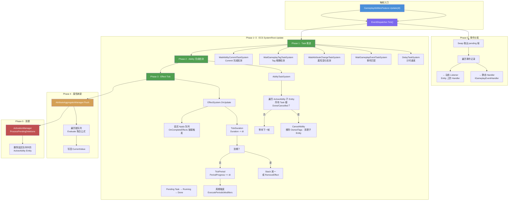
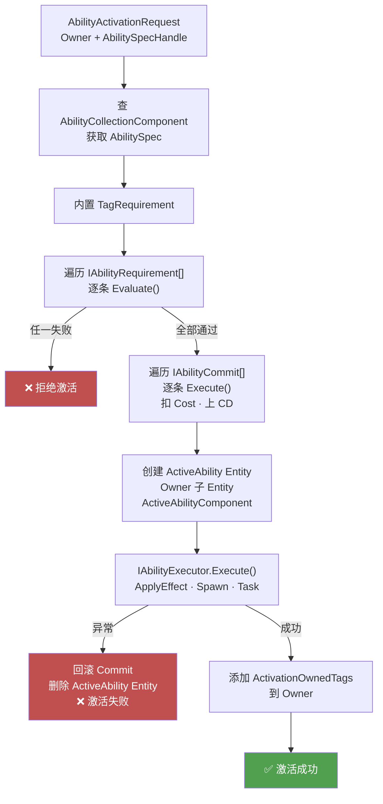
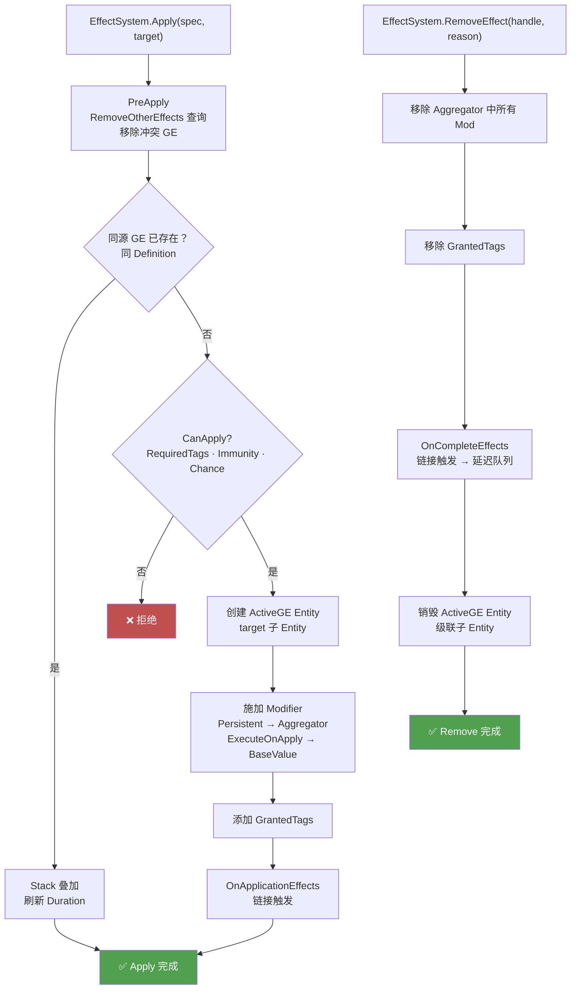
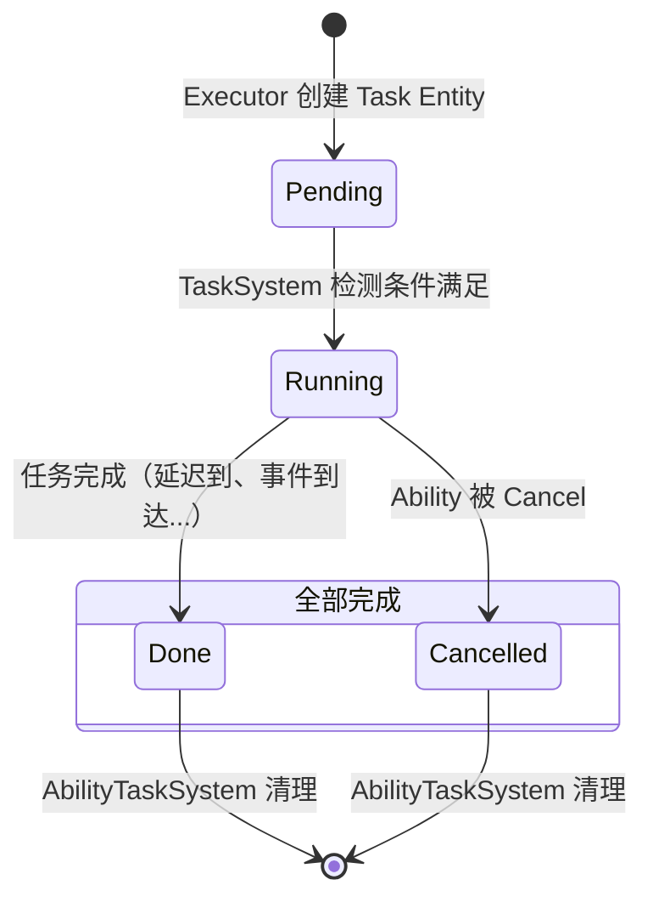
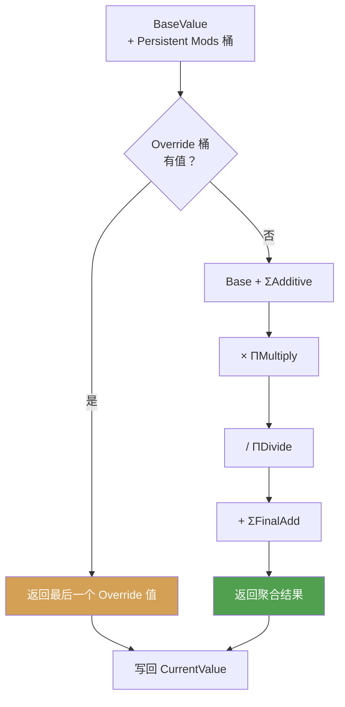

# GAS（Gameplay Ability System）运转指南

Gameplay.NET 的 GAS 子系统基于 **ECS + 命令模式 + 事件驱动**，不设 UE 式巨型中枢组件（ASC），Entity 挂哪些 Component 就具备哪些 GAS 能力。

## 每帧运行流程

`GameplayAbilitiesFeature.Update(deltaTime)` 按 5 个阶段执行：

| 阶段 | 内容 | 说明 |
|------|------|------|
| Phase 0 | Event 交换+分发 | `EventDispatcher.Tick()` — 消费本帧事件 |
| Phase 1 | Task 推进 | Delay / WaitEvent / WaitAttr / WaitTag / WaitCommit System |
| Phase 2 | AbilityTask 完成检测 | `AbilityTaskSystem` — 全部 Task Done → CancelAbility |
| Phase 3 | GE Duration/Period | `EffectSystem.OnUpdate()` — 计时、周期执行、过期 |
| Phase 4 | Attribute 刷新 | `AggregatorManager.Flush()` — 统一 Evaluate + 写回 CurrentValue |
| Phase 5 | 延迟删除 | `ActivationManager.ProcessPendingDeletions()` |

---

## 运行流程图



### Ability 激活流程



### Effect Apply / Remove 流程



### Task 生命周期



### Attribute 聚合公式



---

## 六大子系统

### 1. GameplayTag — 层级标签

`GameplayTag` 是轻量 `int` 句柄，由 `GameplayTagManager` 维护全局层级树。核心操作：

- **精确匹配** `MatchesExact` — id 相等
- **层级匹配** `Matches` — 此 Tag 是 parent 或其子孙（如 `Damage.Fire` 匹配 `Damage`）
- **位集查询** `GameplayTagSet` — 用 `long[]` 位集，`HasAny`/`HasAll` 均为位运算

`GameplayTagContainer` 封装位集，手写 `struct Enumerator` 避免 `foreach` 装箱。

### 2. GameplayAttribute — 属性聚合

每个属性是独立 Component（如 `HealthAttribute`、`ManaAttribute`），Entity 自身即 AttributeSet。

`AttributeAggregatorManager` 内部管理 `Dictionary<AttributeKey, AttributeAggregator>`：

- **BaseValue**：属性基准值
- **Modifier 桶**：按 `Additive` / `Multiply` / `Divide` / `Override` / `FinalAdd` 分桶存储
- **Evaluate 公式**：

```
Override 存在 → 返回最后一个 Override 值
否则 → ((Base + ΣAdd) × ΠMul / ΠDiv) + ΣFinalAdd
```

- **双缓冲脏队列**：修改标记 Dirty → `Flush()` 统一 Evaluate + 写回 CurrentValue

### 3. GameplayEffect — 效果系统

`GameplayEffect` 是静态定义（策划配置的数据资产），`EffectSystem` 是每帧 Tick 的 ECS System。

#### Apply 流程

1. **PreApply** — 按 `RemoveOtherEffectsQueries` 移除冲突 GE
2. **Stacking** — 同源 GE 叠加 StackCount，按策略刷新 Duration
3. **CanApply** — `ApplicationRequiredTags` + `ChanceToApply` 随机 + Immunity 查询
4. **创建 ActiveGE Entity** — 作为 target 的子 Entity
5. **Modifier 施加** — `Persistent` 注册到 Aggregator；`ExecuteOnApply` 直接改 BaseValue
6. **GrantedTags** — 添加授权标签到 target
7. **OnApplicationEffects** — 链接触发其他 GE

#### Remove 流程

- 从 Aggregator 移除所有 Modifier
- 移除 GrantedTags
- 触发 OnCompleteEffects 链接触发
- 销毁 ActiveGE Entity（级联子 Entity）

#### Duration 策略

| 策略 | 行为 |
|------|------|
| `Instant` | 立即执行 Modifier 后销毁 |
| `HasDuration` | Duration 递减至 0 后到期 |
| `Infinite` | 永不自动到期，需手动移除 |

### 4. GameplayAbility — 技能激活

`GameplayAbility` 是静态定义，通过三大接口驱动激活流程：

| 接口 | 阶段 | 特点 |
|------|------|------|
| `IAbilityRequirement.Evaluate()` | 条件检查 | 纯函数，无副作用 |
| `IAbilityCommit.Execute()` | 副作用提交 | 扣 Cost、上 CD，可回滚 |
| `IAbilityExecutor.Execute()` | 执行体 | Apply Effect、Spawn 等实际逻辑 |

**激活流程**：`Request → 查 AbilitySpec → Requirements 检查 → Commit 提交 → 创建 ActiveAbility Entity → Executor 执行（异常则回滚 Commit）`

### 5. AbilityTask — 异步任务

Executor 内部创建 Task Entity，挂在 ActiveAbility Entity 下，每个 Task 有 `TaskStateComponent` 状态机：

```
Pending → Running → Done / Cancelled
```

`AbilityTaskSystem` 检测到**全部 Task 都 Done/Cancelled** 时调用 `CancelAbility` 结束 Ability。

支持的 Task：`DelayTask`、`WaitGameplayEventTask`、`WaitAttributeChangeTask`、`WaitGameplayTagTask`、`WaitAbilityCommitTask`

### 6. GameplayEvent — 事件总线

遵循事件驱动模式，跨系统解耦：

- **生产**：`GameplayEventBus.Enqueue(in record)` → 写入 pending 帧
- **消费**：`EventDispatcher.Tick()` → `Swap` 取出当前帧 → 分发到注册的 Handler
  - **静态 Handler**：`IGameplayEventHandler` 接口，全局生效
  - **动态 Listener**：Entity 上的 Handler，按 `(entityId, handlerId)` 注册/注销

---

## 整体协作示例：火球技能

```
1. 输入触发 → ActivationManager.TryActivateAbility("Fireball")
2. Requirements: CD 可用？蓝量够？Tag 允许？→ 通过
3. Commit: CostCommit 扣蓝量 → CooldownCommit 上 CD
4. Executor: ApplyEffectExecutor
   → EffectSystem.Apply(damageGE, target)       // 瞬时伤害
   → EffectSystem.Apply(burnBuffGE, target)     // 持续灼烧
   → 创建 WaitDelayTask(1s) → 1s 后 CancelAbility
5. 每帧 EffectSystem Tick burnBuffGE:
   → Duration 递减
   → Period 触发 ExecuteOnPeriod 伤害
6. Task 1s 后 Done → AbilityTaskSystem 检测全部完成 → CancelAbility
7. EventBus 发出伤害/治疗事件 → UI 更新、死亡检查等系统响应
```

## 关键设计决策

- **无 ASC**：不建 `AbilitySystemComponent`，Entity 挂哪些 Component 就有哪些 GAS 能力
- **Effect 即 Entity**：GE 运行时实例是 target Entity 的子 Entity
- **命令模式**：Requirement / Commit / Executor 均为接口，可自由组合
- **数据驱动**：GE 和 Ability 都是静态配置资产，代码只定义结构和执行流程
- **POCO + System 混用**：多 Entity 遍历用 ECS System；单例管理用 POCO
